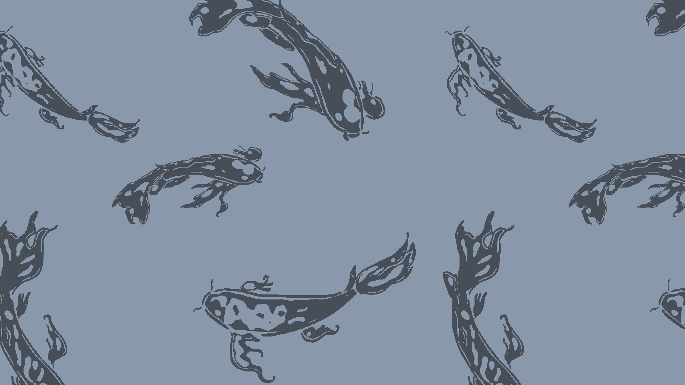

# remotif

Converts legacy CDE/Motif desktop backdrop assets into modern HiDPI PNGs with palette colorization and Scale2x upscaling.



## Quickstart

```sh
docker run --rm -p 8089:8089 ghcr.io/lansing/remotif:latest
```

Then open http://localhost:8089

## Setup

```sh
brew install scale2x
uv sync
make fetch-assets
```

## Usage

```sh
# generate 2x/4x/8x upscaled backdrops with a palette color
uv run python generate.py assets/backdrops/Carps.pm --palette assets/palettes/Broica.dp --slot 3 --scale 2

# all scales at once
uv run python generate.py assets/backdrops/Carps.pm --palette assets/palettes/Broica.dp --slot 3

# with tiled 4K desktop preview
uv run python generate.py assets/backdrops/Carps.pm --palette assets/palettes/Broica.dp --slot 3 --preview

# no palette (use default XPM colors)
uv run python generate.py assets/backdrops/Carps.pm --scale 2

# browse backdrops in the browser with live preview
make preview
```
